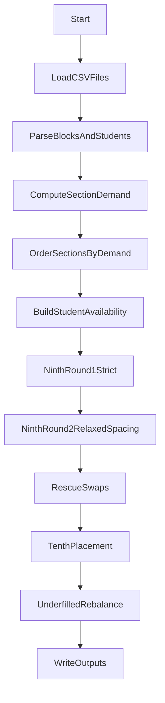
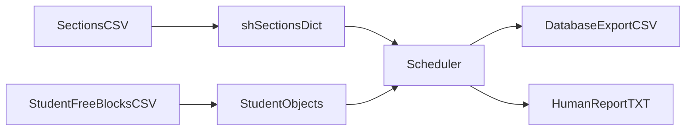

# Daytime Study Hall Scheduling: Oral Defense Prep Notes

## How to use this document
- This is a presentation-prep guide, not a slide script.
- Use the "Suggested visuals" and "Snippet gallery" to decide what to show.
- Copy/paste-ready bullets are included where they help, but you can paraphrase.
- All examples are anonymized; avoid real student identifiers in slides.

---

## 1. Project overview (what and why)
This project schedules daytime study hall placements for students using their free-block availability and the list of available study hall sections. The main challenge is balancing multiple constraints: grade-based requirements, section capacity, spacing between study halls, and fair distribution across sections. The outcome is a feasible schedule plus two outputs: a database-ready enrollment export and a human-readable report for administrators.

**What success means**
- Every 9th grader gets 2 study halls, every 10th grader gets 1, if constraints allow.
- No section exceeds capacity.
- Spacing rules are respected unless explicitly relaxed (and then documented).
- Outputs are generated in both machine- and human-friendly formats.

---

## 2. Inputs and outputs (artifact-driven)
### Inputs
- `data/Study Hall Free Blocks Clean.csv`
  - Columns: student ID, full name, grade, and one column per block (1 means free, blank means busy).
  - The CSV header defines the **block schedule order** used by the algorithm.
- `data/Spring Study Hall Sessions.csv`
  - Columns: internal class ID, class ID, description, grading periods.
  - Each class ID encodes the block (for example, `D4B7`).

### Outputs
- `output/database_output_class_enrollment.csv`
  - Columns: internal class ID, class ID, school year, student ID, grade.
  - Designed for loading into a database or SIS.
- `output/human_report.txt`
  - Summary counts, section fill status, and a list of shortfalls with reasons.
  - Useful for quick validation and administrative review.

**Optional copy/paste bullets**
- "Inputs: student availability grid + study hall section list."
- "Outputs: SIS-ready enrollment CSV and a human-readable audit report."

---

## 3. Data model and invariants
### Key objects
- `Block`
  - Represents a time block with day and block number.
  - Provides `get_distance()` to enforce spacing across the schedule cycle.
  - Implements hashing and equality so it can be used as dict keys and set members.
- `Student`
  - `free_blocks`: set of available blocks for fast membership checks.
  - `availability`: ordered list of study hall blocks sorted by demand and priority.
  - `scheduled_sh`: study halls already assigned.
  - `notes`: explanations for relaxed rules or moves.
- `_sh_sections` (dict)
  - Key: `Block`
  - Values include `list_of_students`, `num_of_students_in_here`, and `demand`.

### Invariants enforced by design
- A student is never double-counted in the same section.
- Section counts stay in sync with student schedules.
- Capacity checks happen before placement (and during rescues).

---

## 4. Core constraints and heuristics (defense focus)
### Hard constraints
- Grade targets:
  - 9th grade: 2 study halls
  - 10th grade: 1 study hall
- Capacity: `max_ppl_per_sh = 35`
- Spacing: for 9th graders, avoid study halls too close in the cycle (`get_distance() > 1`)

### Heuristics and priorities
- **Demand heuristic**: sections with lower demand are chosen first to spread load.
- **Block priority**: blocks 2 and 4 are favored over block 1.
- **Greedy assignment**: place students with fewer options first.
- **Rescue swaps**: if a needed section is full, attempt a safe swap.
- **Underfilled balancing**: move students from full sections into underfilled ones.

**Optional copy/paste bullets**
- "I used a greedy heuristic: schedule the most constrained students first."
- "Demand-based ordering spreads students across sections early."

---

## 5. Algorithm workflow (high-level narrative)
1. Read CSVs and build `Block`, `Student`, and section structures.
2. Compute section demand (how many students could use each block).
3. Order sections by demand and priority, then build each student's availability list.
4. Schedule 9th graders in two rounds:
   - Round 1: strict spacing.
   - Round 2: relax spacing if necessary (and add notes).
5. Rescue round: try capacity swaps for remaining 9th graders.
6. Schedule 10th graders.
7. Rebalance underfilled sections by moving students from high-fill sections.
8. Write CSV export and a human report.

---

## 6. Toy example walkthrough (anonymized)
**Scenario**
- Sections (capacity 2 each): `D1B1`, `D2B2`, `D3B3`
- Students:
  - A (9th): free `D1B1`, `D2B2`, `D3B3`
  - B (9th): free `D1B1`, `D2B2`
  - C (10th): free `D2B2`
  - D (9th): free `D1B1`, `D3B3`

**Demand counts**
- `D1B1`: A, B, D (3)
- `D2B2`: A, B, C (3)
- `D3B3`: A, D (2)

**Greedy placement**
- D (fewer options) gets `D3B3` first (lower demand).
- B gets `D1B1`.
- A gets `D2B2` (next best candidate).

**Rescue swap idea**
If A needed a second study hall but `D1B1` was full, the algorithm would check if a current student in `D1B1` can move to another open block, then swap.

Use this story to show how the algorithm prioritizes constrained students and spreads load.

---

## 7. Complexity discussion (big-O)
Let:
- `S` = number of students
- `B` = number of sections
- `A` = average availability per student

Main costs:
- Demand computation: `O(S * B)` worst case.
- Sorting sections: `O(B log B)`.
- Building availability lists: `O(S * B)`.
- Placement rounds: `O(S * A)` for candidate filtering and choosing best.
- Rescue swaps: worst case `O(S * A * C)` where `C` is section size, but typically much smaller.
- Underfilled balancing: `O(U * D * C)` where `U` is underfilled sections and `D` donor sections.

Talking point: the approach is efficient enough for hundreds of students and a few dozen sections.

---

## 8. Results from the current dataset (aggregate only)
From `output/human_report.txt`:
- Total students: 193
- Total enrollments: 354
- 9th graders: 161 students, all assigned 2 study halls
- 10th graders: 32 students, all assigned 1 study hall
- Underfilled sections: 0

Note: If you re-run on new data, update these numbers from the latest report.

---

## 9. Snippet gallery (short, high-signal)
Use these in slides if you want to show code. Each snippet is short and highlights a core idea.

### A. Schedule spacing rule (`Block.get_distance`)
```py
def get_distance(self, other) -> int: #returns 1, 2, 3, or 4
    seq = [1, 5, 2, 6, 3, 7, 4] #hardcoded sequence of the schedule days
    self_index = seq.index(self.day)
    target_index = seq.index(other.day)
    forward = (target_index - self_index) % len(seq)
    return min(forward, 7 - forward)
```
- What it shows: the custom cycle ordering used to keep study halls spaced.
- Talking point: spacing is a domain rule, not just a generic time difference.

### B. Grade target logic (`Student.needs_sh`)
```py
def needs_sh(self):
    if self.grade == 9:
        target = 2
    else:
        target = 1
    numberOF_current_sh = len(self.scheduled_sh)
    numberOF_remaining_free = len(self.free_blocks) - numberOF_current_sh
    return numberOF_current_sh < target and numberOF_remaining_free > 1
```
- What it shows: grade-based requirements and a sanity check on remaining free blocks.
- Talking point: ensures we do not over-push students with no remaining availability.

### C. Demand heuristic (`compute_sh_section_demand`)
```py
def compute_sh_section_demand(students, sh_sections) -> dict:
    for s in students:
        availabilities = list(b for b in s.free_blocks if b in sh_sections)
        for avail in availabilities:
            sh_sections[avail]["demand"] += 1
```
- What it shows: demand is counted before scheduling begins.
- Talking point: demand drives ordering to avoid early overload.

### D. Best-candidate selection (`get_valid_candidates`, `pick_best_section`)
```py
def get_valid_candidates(student, sh_sections, max_capacity):
    candidates = []
    for avail in student.availability:
        if sh_sections[avail]["num_of_students_in_here"] >= max_capacity:
            continue
        if not all(avail.get_distance(scheduled) > 1 for scheduled in student.scheduled_sh):
            continue
        candidates.append(avail)
    return candidates

def pick_best_section(candidates, sh_sections):
    if not candidates:
        return None
    priority = {2:0, 4:0, 1:1}
    return min(candidates, key=lambda block: (
        sh_sections[block]["demand"],
        priority[block.which_block()],
        sh_sections[block]["num_of_students_in_here"]
    ))
```
- What it shows: capacity + spacing filter, then a 3-way tie-break.
- Talking point: heuristic selection uses demand, block priority, and current fill.

### E. Rescue swaps (`rescue_capacity_swaps_for_ninth`)
```py
for donor in list(sh_sections[alt]["list_of_students"]):
    ok, donor_destination = donor.can_move_out(alt, sh_sections, max_ppl_per_sh)
    if ok and donor_destination is not None:
        if student.add_sh(alt):
            swap_and_move(student, donor, alt, donor_destination, sh_sections)
            rescued += 1
            placed = True
            break
```
- What it shows: swap-based rescue when all candidates are at capacity.
- Talking point: adds flexibility while respecting capacity and spacing.

### F. Underfilled rebalancing (post-pass)
```py
underfilled_sections = [sh for sh in _sh_sections if 0 < _sh_sections[sh]["num_of_students_in_here"] < min_ppl_per_sh]
for und in underfilled_sections:
    while _sh_sections[und]["num_of_students_in_here"] < min_ppl_per_sh:
        donor_sections = [b for b in _sh_sections if _sh_sections[b]["num_of_students_in_here"] > 25]
        for donor in donor_sections:
            for student in list(_sh_sections[donor]["list_of_students"]):
                if und not in student.availability or und in student.scheduled_sh:
                    continue
                if not all(und.get_distance(scheduled) > 1 for scheduled in student.scheduled_sh if scheduled != donor):
                    continue
                update_sh_section("add", student, und, _sh_sections)
                update_sh_section("remove", student, donor, _sh_sections)
                student.notes.append(
                    f"Reassigned from {donor} to {und} to help meet minimum enrollment in {und} (min {min_ppl_per_sh})."
                )
                break
```
- What it shows: balancing underfilled sections after primary scheduling.
- Talking point: adds an administrative quality check, not just feasibility.

### G. Human report summary (auditability)
```py
lines.append("SUMMARY")
lines.append(f"Total students: {len(_students)}")
lines.append(f"Total enrollments: {total_enrollments}")
lines.append("9th Graders (target: 2 study halls):")
lines.append(f"2 study halls: {ninth_2}")
lines.append("10th Graders (target: 1 study hall):")
lines.append(f"1 study hall:  {tenth_1}")
```
- What it shows: transparency and easy validation.
- Talking point: reporting makes the algorithm defensible and auditable.

---

## 10. Suggested visuals for slides
### A. Algorithm flow (use this as a slide diagram)


### B. Data flow (use as a supporting diagram)


### C. Decision rule graphic (simple text box)
- "Pick best candidate by: lowest demand -> preferred block -> lowest current fill."

---

## 11. Likely Q&A (oral defense prep)
- **Why greedy instead of optimal?**  
  It is simpler, faster, and good enough for real-world constraints, while still respecting key rules.
- **How do you ensure fairness?**  
  Demand-based ordering and block priority spread students across sections, and spacing reduces clustering.
- **What happens when constraints conflict?**  
  The algorithm relaxes spacing only when necessary and records a note for auditability.
- **How is correctness validated?**  
  Counts in the human report confirm targets and section fills; notes explain exceptions.
- **What would you improve?**  
  Replace heuristics with a formal optimizer (ILP or min-cost flow) to compare outcomes.

---

## 12. Limitations and future work
- The schedule cycle is hardcoded in `Block.get_distance()`.
- Greedy selection is not globally optimal.
- CSV parsing is customized; more robust parsing could improve reliability.
- Future work: formal optimization baseline, weighted objectives, and constraint tuning.

---

## 13. Demo steps (if you show a live run)
1. Run `scripts/main.py` directly (uses file paths in `__main__`).
2. Show the two output artifacts.
3. Point out the summary counts and "notes" section in the human report.
